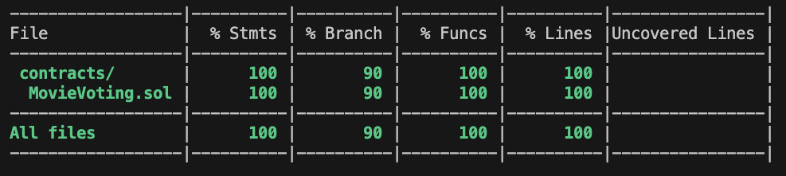

# Smart Contract Voting

This repo contains a smart contract that allows users to vote from a predefined list. The voting is open for a specified duration, after which the votes are counted to determine the winner. The contract provides functions to create a poll, start voting, cast votes and tally the results. Each poll is associated with the user who created it.

## Features

- **Create Polls**: Users can create a new poll with a list and specified voting duration.
- **Start Voting**: The creator of a poll can start the voting process, allowing participants to cast their votes.
- **Cast Votes**: Participants can vote...duhh =))
- **Count Votes**: At the end of the voting period, votes are tallied automatically and the winner is announced.
- **Ownership and Permissions**: Each poll is associated with the user who created it and only the creator has certain administrative rights over the poll.

## Optimizations and Security Measures

The contract includes several gas optimizations and security features to enhance its performance and safety:

1. **Memory Optimization for Arrays**:

   - **What was done**: The `endVoting` function uses the `memory` keyword for the `movies` array instead of `storage`.
   - **Why it’s important**: Accessing data in memory is cheaper in terms of gas compared to storage. Storage operations are significantly more expensive in Solidity, so minimizing their use can lead to substantial gas savings.
   - **How it improves gas usage**: By copying the array to memory once and working with it from there, the contract reduces the number of expensive storage reads, optimizing gas usage during execution.

2. **Use of Custom Errors**:

   - **What was done**: The contract defines custom errors such as `PollNotFound`, `AlreadyVoted` and `InvalidMovie`.
   - **Why it’s important**: Custom errors consume less gas than traditional `require` statements with string messages because they save the bytecode space needed to store the error messages.
   - **How it improves gas usage**: This approach reduces the gas cost when a transaction is reverted, especially if the error messages are long or if the reverts are frequent.

3. **Gas-Efficient Existence Check Using a Mapping**:

   - **What was done**: The contract includes a `mapping(string => bool) movieExists` in the `Poll` struct to quickly verify if a movie exists in the poll.
   - **Why it’s important**: Directly checking the existence of an item in a mapping is much cheaper than iterating through an array, especially for large data sets.
   - **How it improves gas usage**: This reduces the computational cost associated with vote validation, particularly as the number of movies in the poll increases.

## What's in the Repository

- **`MovieVoting.sol`**: The smart contract file containing all the logic for voting.
- **Test files**: Tests to ensure the contract functions as expected and meets the required coverage.
- **Deployment scripts**: Scripts to deploy the contract to the Ethereum network.

## Installation and Usage

To get started with the Smart Contract Voting, follow these steps:

**Clone the repository**:

```
git clone https://github.com/yourusername/SmartContractVoting.git
cd SmartContractVoting
```

Make sure you have [Node.js](https://nodejs.org/) installed and then install the necessary packages:

```
npm install
```

## Compile the smart contract:

Use the Hardhat framework to compile the contract:

```
npx hardhat compile
```

# Run tests:

To ensure everything is working correctly and to see the test coverage, run:

```
npx hardhat test
```

# Test Results



# Deploy the contract:

Before deploying, configure your deployment settings (network, private keys, etc.) in hardhat.config.js, then deploy:

```
npx hardhat run scripts/deploy.js --network yourNetwork
```

## Link to contract

[Link to contract on Etherscan](https://sepolia.etherscan.io/address/0x4D616D7c038c192fC7BCAFA1a1d037B2540F199e#code)
